# 🧴 Skincare Store Project

## 📌 Project Description

The Skincare Store is a responsive e-commerce web application developed using React.js. The website allows users to browse skincare products, search for products, add items to a shopping cart or wishlist, and complete a checkout process.

The application demonstrates modern front-end development techniques and responsive web design principles through reusable React components, state management, and client-side routing.

---

## ⚙️ Setup Instructions

### Clone the Repository

```bash
git clone https://github.com/elianmoussa770-jpg/Skincare-store.git
cd Skincare-store
```

### Install Dependencies

```bash
npm install
```

### Run the Application

```bash
npm start
```

### Build for Production

```bash
npm run build
```

---

## 📸 Screenshots of the UI
### 📱 Responsive Home Page

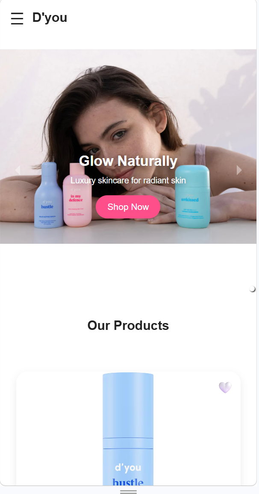

### 🏠 Home Page

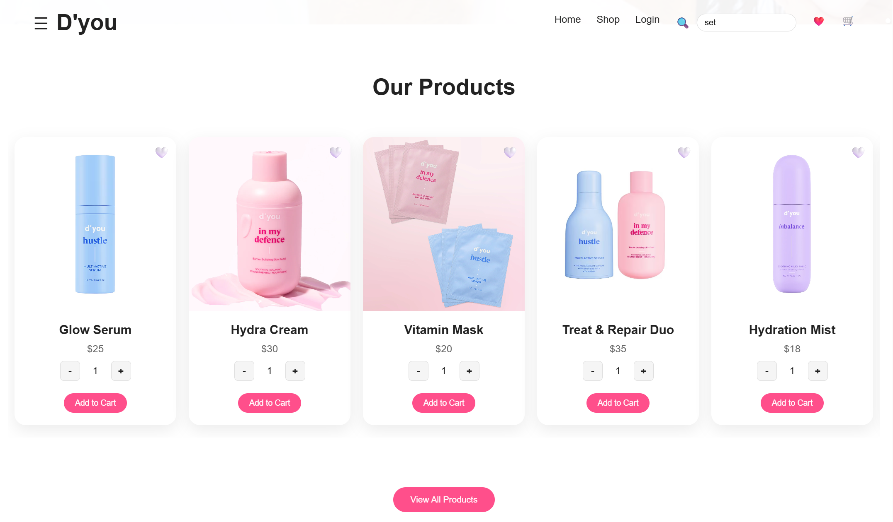
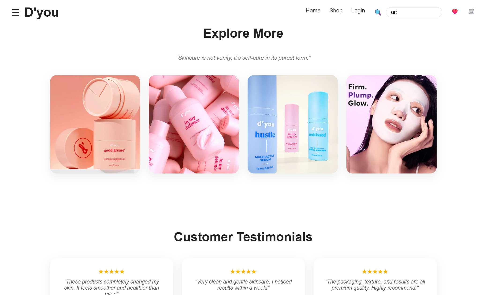
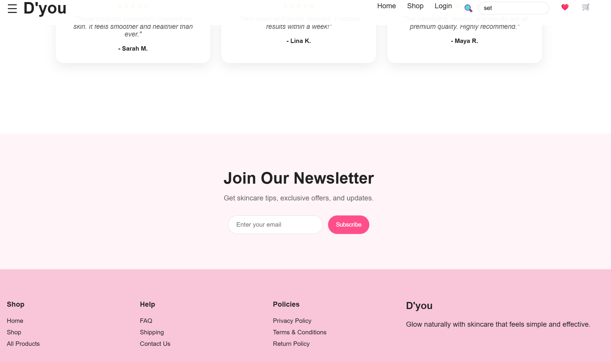


### 🛍️ Shop Page

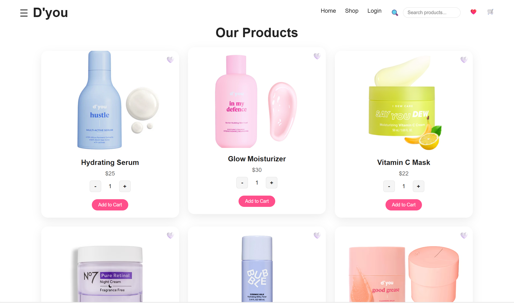

### ❤️ Wishlist Page

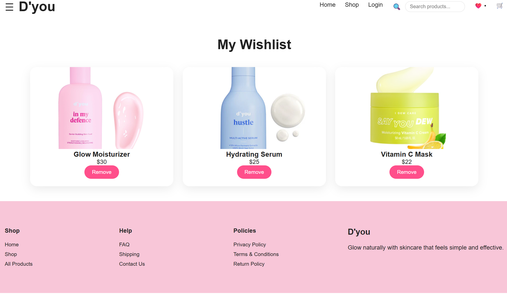

### 🛒 Cart Page

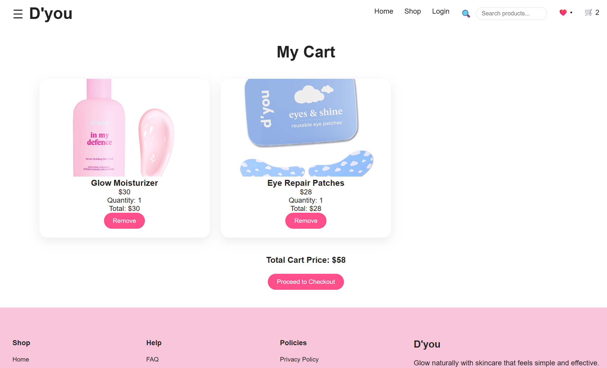

### 💳 Checkout Page

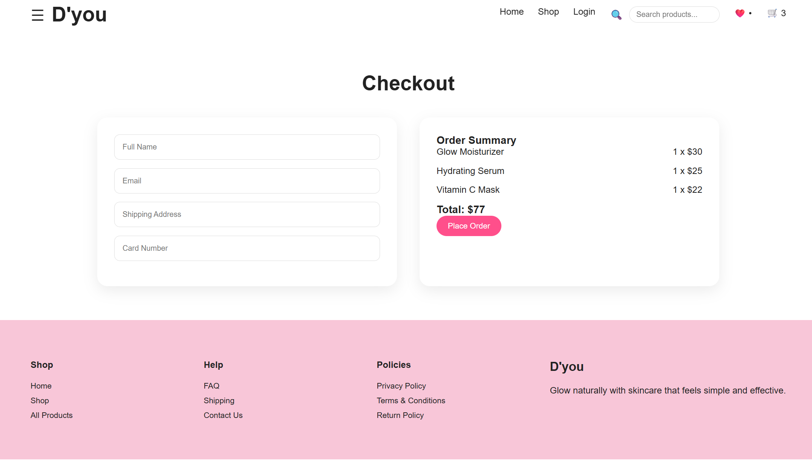

###  Privacy Page
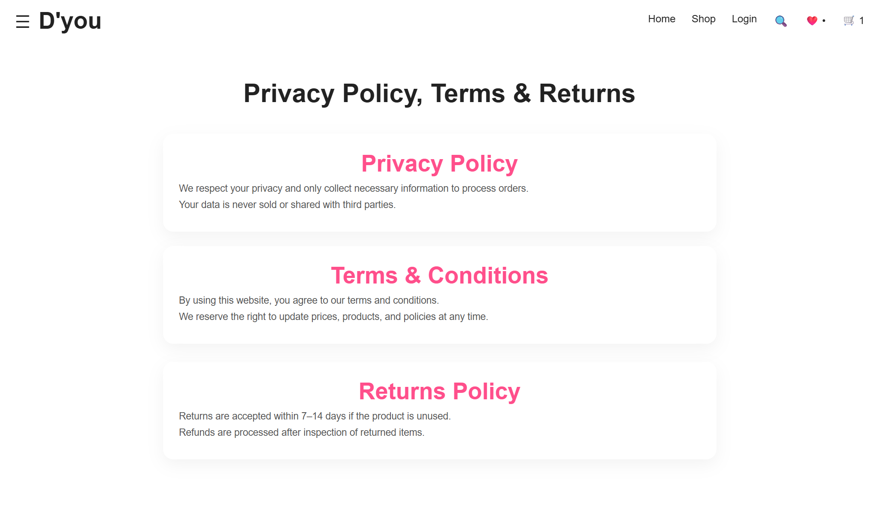

###  FAQ Page
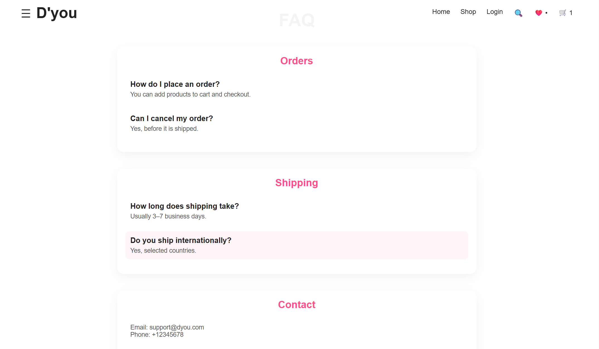

###  Description Page
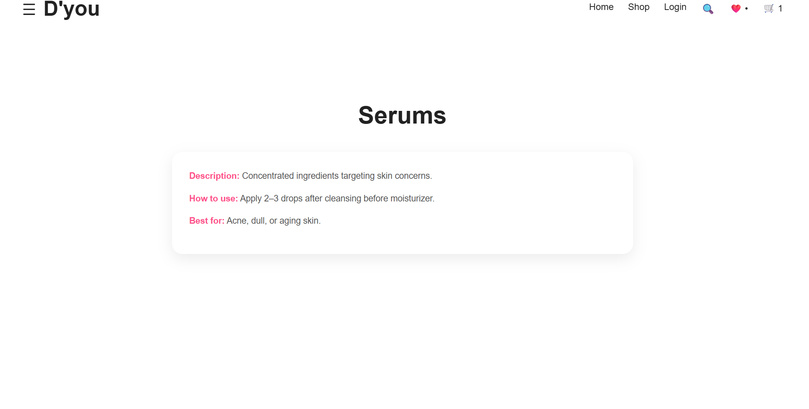


---

## 🧑‍💻 Technologies Used

* React.js
* React Router DOM
* JavaScript (ES6+)
* CSS3
* HTML5
* Context API
* GitHub Pages

---

## ✨ Features

* Responsive design for desktop and mobile devices
* Product search functionality
* Shopping cart management
* Wishlist functionality
* Checkout page with form validation
* Success page after order placement
* Dynamic navigation using React Router

---

## 👨‍💻 Author

**Elian Moussa**
